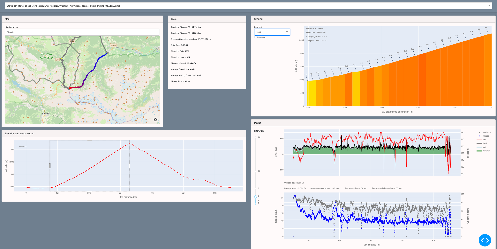
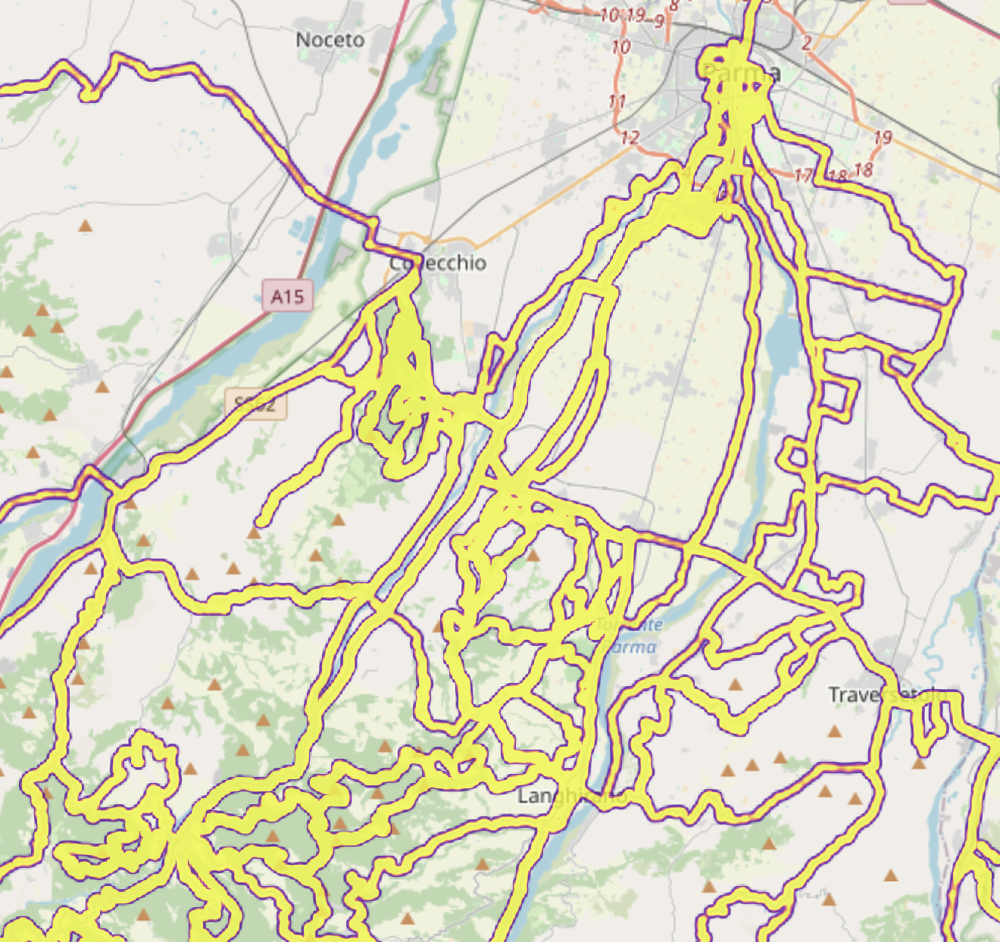

# Geppetto

A browser-based gpx (and fit) track analyser, great for cycling traces.

## Requirements

Developed with Python 10.0.0. Install required modules with:

    pip install -r requirements.txt

## Launch the app

Launch the web app on the server:

    python geppetto.py

Then open [http://localhost:8050/](http://localhost:8050/) in a web browser.

## Generate a heatmap

The first time (or any time you want to update the heatmap file)

    python heatmap.py -f /path/to/activities --lonc 10 --latc 45

To plot the heatmap from previously imported activities

    python heatmap.py --lonc 10 --latc 45

## Project structure

* `geppetto.py` is the web app
* `heatmap.py` command line interface to generate a heatmap
* `mate.py` is where all the math is
* `tracks/` is where all the `.gpx` and `.fit` files are
* `heatmap/` where the heatmap data file is stored

## To do and known bugs

| Status     | Item                                                           |
|:----------:|----------------------------------------------------------------|
| TODO       | Weird overlap of values on the left of "more and more local passes" trace. Uncommenting the steps line in geppetto causes the gradient function to crash. |
| Workaround | Tap plot doesn't update when a new file is loaded or a portion of it is selected from the elevation plot. Posted here https://github.com/plotly/dash/issues/1152. It has been solved with this workaround https://github.com/plotly/plotly.js/issues/6363. |

## Documentation

### Importing

* https://towardsdatascience.com/parsing-fitness-tracker-data-with-python-a59e7dc17418

### Maths

* https://thatmaceguy.github.io/python/gps-data-analysis-intro/
* https://rkurchin.github.io/posts/2020/05/ftp

### Plotly

* https://plotly.com/python/mapbox-layers/
* https://plotly.com/python/builtin-colorscales/
* https://github.com/plotly/plotly.py/issues/1728
* https://plotly.com/python/filled-area-plots/
* https://plotly.com/python/mapbox-layers/#using-layoutmapboxlayers-to-specify-a-base-map

### Dash

* https://dash.plotly.com/interactive-graphing
* https://dash.plotly.com/sharing-data-between-callbacks
* https://dash-bootstrap-components.opensource.faculty.ai/docs/components/layout/
* https://getbootstrap.com/docs/5.1/layout/gutters/
* https://www.dash-mantine-components.com/components/checkbox
* https://www.w3schools.com/colors/colors_names.asp
* https://dash-bootstrap-components.opensource.faculty.ai/docs/components/card/
* https://stackoverflow.com/questions/63592900/plotly-dash-how-to-design-the-layout-using-dash-bootstrap-components
* https://github.com/facultyai/dash-bootstrap-components/issues/286
* https://community.plotly.com/t/preserving-ui-state-like-zoom-in-dcc-graph-with-uirevision-with-dash/15793
* https://stackoverflow.com/questions/70548975/how-to-add-values-from-selecteddata-input-to-a-list
* https://plotly.com/python-api-reference/generated/plotly.graph_objects.Scattermapbox.html
* 