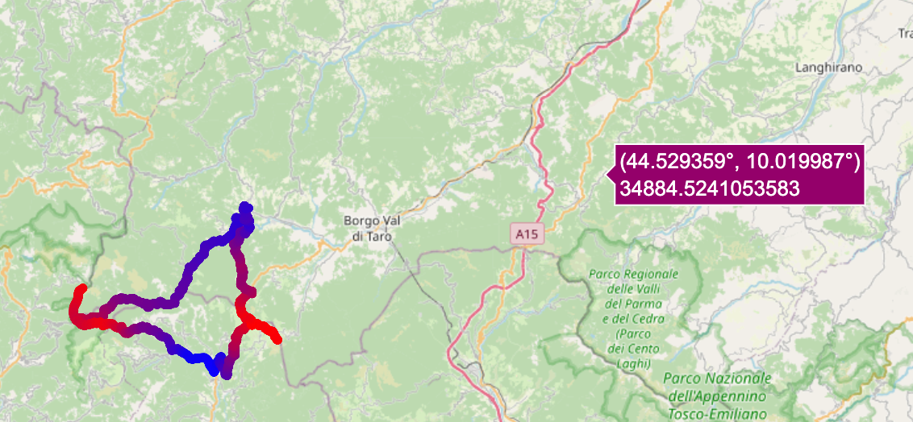

# GePpetto

A homemade gpx viewer able to create climb gradient plots.

    python app.py

Then open [http://localhost:8050/](http://localhost:8050/) in a web browser.

## Requirements

Developed with Python 10.0.0. Install required modules with:

    pip install -r requirements.txt

## Project structure

* `app.py` is the web app
* `geppetto.py` is where all the math is
* `geppetto_obj.py` is an object implementation of `geppetto.py` that is not maintained because it doesn't work well
  with the Dash app
* `tracks/` is where all the `.gpx` and `.fit` files are

## Known bugs

1. The app interface looks very bad
2. For some unknown reason, the map plot doesn't update when a new file is loaded or a portion of it is selected from the
  elevation plot. It looks like the trace is cached somewhere. It's the only plot that doesn't react to updates. Posted 
  here https://github.com/plotly/dash/issues/1152. This
  makes no sense because
    * its center updates correctly
    * datapoints are updated correctly 
    * if replaced with a scatter, it updates correctly
    * the other minimap in the gradient plot updates as expected
   Posted in https://github.com/plotly/dash/issues/1152

## Documentation

### Importing
* https://towardsdatascience.com/parsing-fitness-tracker-data-with-python-a59e7dc17418

### Maths
* https://thatmaceguy.github.io/python/gps-data-analysis-intro/
* https://rkurchin.github.io/posts/2020/05/ftp

### Plotly
* https://plotly.com/python/mapbox-layers/
* https://plotly.com/python/builtin-colorscales/
* https://github.com/plotly/plotly.py/issues/1728
* https://plotly.com/python/filled-area-plots/
* https://plotly.com/python/mapbox-layers/#using-layoutmapboxlayers-to-specify-a-base-map

### Dash
* https://dash.plotly.com/interactive-graphing
* https://dash.plotly.com/sharing-data-between-callbacks
